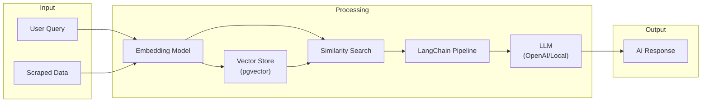

# LangChain AI Integration Guide

## Overview

This guide covers integrating LangChain4j (Java) with the Spring Boot backend for AI-powered data analysis using RAG (Retrieval-Augmented Generation).

## Project Structure

```
ai-service/
├── src/main/java/com/webscraper/ai/
│   ├── config/
│   │   ├── LangChainConfig.java
│   │   └── EmbeddingConfig.java
│   │
│   ├── service/
│   │   ├── AIAnalysisService.java
│   │   ├── EmbeddingService.java
│   │   └── RAGService.java
│   │
│   ├── repository/
│   │   └── VectorRepository.java
│   │
│   └── model/
│       ├── AnalysisRequest.java
│       └── AnalysisResponse.java
│
└── pom.xml
```

## Architecture Diagram



## Core Components

### LangChain Configuration
```java
// config/LangChainConfig.java
@Configuration
public class LangChainConfig {
    
    @Value("${openai.api-key}")
    private String openAiApiKey;
    
    @Bean
    public ChatLanguageModel chatModel() {
        return OpenAiChatModel.builder()
            .apiKey(openAiApiKey)
            .modelName("gpt-4-turbo-preview")
            .temperature(0.7)
            .build();
    }
    
    @Bean
    public EmbeddingModel embeddingModel() {
        return OpenAiEmbeddingModel.builder()
            .apiKey(openAiApiKey)
            .modelName("text-embedding-3-small")
            .build();
    }
    
    @Bean
    public EmbeddingStore<TextSegment> embeddingStore(DataSource dataSource) {
        return PgVectorEmbeddingStore.builder()
            .dataSource(dataSource)
            .table("scraped_data")
            .dimension(1536)
            .build();
    }
}
```

### RAG Service
```java
// service/RAGService.java
@Service
@RequiredArgsConstructor
public class RAGService {
    
    private final ChatLanguageModel chatModel;
    private final EmbeddingModel embeddingModel;
    private final EmbeddingStore<TextSegment> embeddingStore;
    
    public String analyzeWithContext(String query, List<String> contextData) {
        // Create embeddings for context
        List<TextSegment> segments = contextData.stream()
            .map(TextSegment::from)
            .toList();
        
        List<Embedding> embeddings = embeddingModel.embedAll(segments).content();
        
        // Store embeddings (if not already stored)
        embeddingStore.addAll(embeddings, segments);
        
        // Search for relevant context
        Embedding queryEmbedding = embeddingModel.embed(query).content();
        List<EmbeddingMatch<TextSegment>> matches = embeddingStore
            .findRelevant(queryEmbedding, 5);
        
        // Build context from matches
        String context = matches.stream()
            .map(match -> match.embedded().text())
            .collect(Collectors.joining("\n\n"));
        
        // Create prompt with context
        String prompt = buildPrompt(query, context);
        
        // Generate response
        return chatModel.generate(prompt);
    }
    
    private String buildPrompt(String query, String context) {
        return """
            You are a data analyst assistant. Use the following scraped website data 
            to answer the user's question accurately and concisely.
            
            CONTEXT:
            %s
            
            USER QUESTION:
            %s
            
            Provide a clear, structured response based on the data provided.
            """.formatted(context, query);
    }
}
```

### AI Analysis Service
```java
// service/AIAnalysisService.java
@Service
@RequiredArgsConstructor
@Transactional
public class AIAnalysisService {
    
    private final RAGService ragService;
    private final ScrapedDataRepository dataRepository;
    private final AIAnalysisRepository analysisRepository;
    
    public AnalysisResponse analyze(AnalysisRequest request, UUID userId) {
        // Fetch scraped data
        List<ScrapedData> data = dataRepository.findAllById(request.getDataIds());
        
        List<String> contextData = data.stream()
            .map(d -> d.getParsedData().toString())
            .toList();
        
        // Run RAG
        String response = ragService.analyzeWithContext(
            request.getQuery(), 
            contextData
        );
        
        // Save analysis
        AIAnalysis analysis = AIAnalysis.builder()
            .userId(userId)
            .analysisType(request.getAnalysisType())
            .query(request.getQuery())
            .response(response)
            .metadata(Map.of("dataCount", data.size()))
            .build();
        
        analysis = analysisRepository.save(analysis);
        
        return AnalysisResponse.from(analysis);
    }
    
    public List<TextSegment> semanticSearch(String query, UUID jobId, int limit) {
        List<ScrapedData> data = dataRepository.findByJobId(jobId);
        
        // Embed and search
        Embedding queryEmbedding = embeddingModel.embed(query).content();
        
        return embeddingStore.findRelevant(queryEmbedding, limit)
            .stream()
            .map(EmbeddingMatch::embedded)
            .toList();
    }
}
```

### Embedding Service
```java
// service/EmbeddingService.java
@Service
@RequiredArgsConstructor
public class EmbeddingService {
    
    private final EmbeddingModel embeddingModel;
    private final ScrapedDataRepository dataRepository;
    
    @Async
    public void generateEmbeddings(UUID jobId) {
        List<ScrapedData> dataList = dataRepository.findByJobIdAndEmbeddingIsNull(jobId);
        
        for (ScrapedData data : dataList) {
            String content = data.getParsedData().toString();
            Embedding embedding = embeddingModel.embed(content).content();
            
            // Convert to pgvector format
            float[] vector = embedding.vector();
            data.setEmbedding(vector);
            dataRepository.save(data);
        }
    }
}
```

## Maven Dependencies

```xml
<dependencies>
    <!-- LangChain4j -->
    <dependency>
        <groupId>dev.langchain4j</groupId>
        <artifactId>langchain4j</artifactId>
        <version>0.25.0</version>
    </dependency>
    <dependency>
        <groupId>dev.langchain4j</groupId>
        <artifactId>langchain4j-open-ai</artifactId>
        <version>0.25.0</version>
    </dependency>
    <dependency>
        <groupId>dev.langchain4j</groupId>
        <artifactId>langchain4j-embeddings</artifactId>
        <version>0.25.0</version>
    </dependency>
    <dependency>
        <groupId>dev.langchain4j</groupId>
        <artifactId>langchain4j-pgvector</artifactId>
        <version>0.25.0</version>
    </dependency>
</dependencies>
```

## Configuration

```yaml
# application.yml
openai:
  api-key: ${OPENAI_API_KEY}

langchain:
  embedding:
    model: text-embedding-3-small
    dimensions: 1536
  chat:
    model: gpt-4-turbo-preview
    temperature: 0.7
```

## Usage Examples

### Summarize Scraped Data
```java
AnalysisRequest request = AnalysisRequest.builder()
    .query("Summarize the main products and their prices")
    .dataIds(List.of(dataId1, dataId2))
    .analysisType(AnalysisType.SUMMARY)
    .build();

AnalysisResponse response = aiService.analyze(request, userId);
```

### Semantic Search
```java
List<TextSegment> results = aiService.semanticSearch(
    "products under $50", 
    jobId, 
    10
);
```
