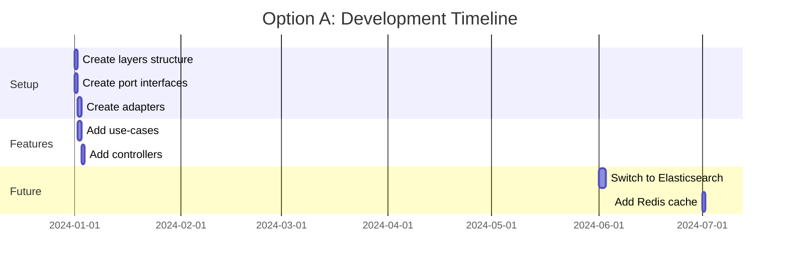
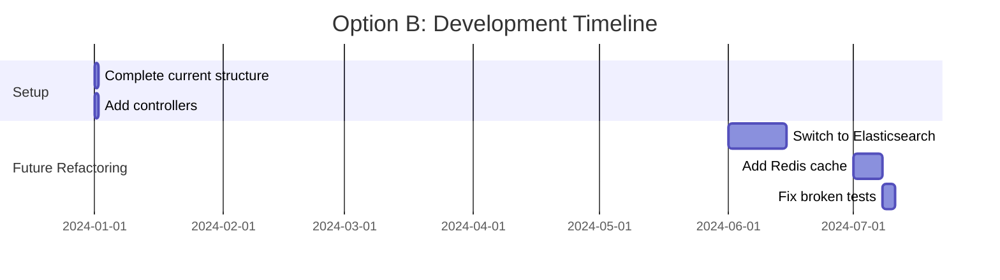

# Clean Architecture vs Pragmatic Approach: Full Comparison

## Executive Summary

| Criteria | Option A (Clean Architecture) | Option B (Pragmatic) |
|----------|------------------------------|---------------------|
| Setup Time | 2-3 hours | 1 hour |
| Long-term Maintainability | ⭐⭐⭐⭐⭐ Excellent | ⭐⭐⭐ Good |
| Big Data Scalability | ⭐⭐⭐⭐⭐ Excellent | ⭐⭐⭐ Moderate |
| Team Onboarding | ⭐⭐⭐⭐ Easy (clear structure) | ⭐⭐ Harder (mixed layers) |
| Testing Ease | ⭐⭐⭐⭐⭐ Excellent | ⭐⭐⭐ Moderate |
| Flexibility to Change DB | ⭐⭐⭐⭐⭐ Easy | ⭐⭐ Hard |
| File Count | ~80 files | ~40 files |
| **Recommendation for Big Data** | ✅ **Best Choice** | ⚠️ Works, but harder to scale |

---

## Scenario: Growing to Big Data (1M+ pages, 10M+ chunks)

### Option A: Clean Architecture

```
Year 1: 10K pages, 100K chunks
├── Works perfectly
├── Easy to add new features
└── Tests run fast (mocked dependencies)

Year 2: 100K pages, 1M chunks
├── Need to switch from PostgreSQL → Elasticsearch for search
├── EASY: Just create new ElasticsearchPageRepository adapter
├── Domain layer unchanged
└── Use-cases unchanged

Year 3: 1M pages, 10M chunks
├── Need horizontal scaling (multiple instances)
├── EASY: Swap InMemoryJobQueue → RabbitMQ/Kafka
├── No code changes in use-cases
└── Add Redis cache adapter
```

### Option B: Pragmatic Approach

```
Year 1: 10K pages, 100K chunks
├── Works perfectly
├── Faster to build initially
└── Fewer files to manage

Year 2: 100K pages, 1M chunks
├── Need to switch from PostgreSQL → Elasticsearch
├── HARD: JPA entities mixed with business logic
├── Must rewrite services
└── Risk breaking existing features

Year 3: 1M pages, 10M chunks
├── Need horizontal scaling
├── VERY HARD: Queue implementation tangled in services
├── Major refactoring required
└── May need to rewrite 50% of codebase
```

---

## Detailed Comparison Table

| Aspect | Option A: Clean Architecture | Option B: Pragmatic |
|--------|------------------------------|---------------------|
| **Initial Setup** | | |
| Development time | 2-3 hours | 1 hour |
| Files created | ~80 | ~40 |
| Learning curve | Medium (need to understand layers) | Low |
| **Code Quality** | | |
| Single Responsibility | ✅ Each class does one thing | ⚠️ Services do multiple things |
| Dependency Inversion | ✅ All dependencies via interfaces | ❌ Direct dependencies |
| Testability | ✅ Easy to mock everything | ⚠️ Harder, need DB for tests |
| **Scalability** | | |
| Add new scraper engine | ✅ Add new adapter, no changes | ⚠️ Modify existing service |
| Switch database | ✅ Create new adapter | ❌ Rewrite repositories + services |
| Add caching layer | ✅ Add caching adapter | ⚠️ Modify multiple services |
| Horizontal scaling | ✅ Stateless, queue-based | ⚠️ May have state issues |
| **Big Data Scenarios** | | |
| 1M+ rows performance | ✅ Easy to add specialized repos | ⚠️ Harder to optimize |
| Bulk operations | ✅ Create specialized use-case | ⚠️ Modify existing services |
| Read/Write separation | ✅ Create read-only adapters | ❌ Major restructure needed |
| **Team & Maintenance** | | |
| New developer onboarding | ✅ Clear structure, easy to find code | ⚠️ Need to explain conventions |
| Bug isolation | ✅ Errors isolated to one layer | ⚠️ Errors can cascade |
| Feature addition | ✅ Add use-case, adapter if needed | ⚠️ Modify existing services |

---

## Code Examples: Swapping Components

### Example 1: Switching from PostgreSQL to Elasticsearch (Big Data Search)

**Option A (Clean Architecture)**:
```java
// Step 1: Create new adapter (no changes to existing code)
@Component
@Profile("elasticsearch")  // Activated by config
class ElasticsearchPageRepository implements PageRepository {
    private final ElasticsearchClient client;
    
    Page findByUrlHash(UrlHash hash) {
        // Elasticsearch query
    }
}

// Step 2: application.yml
spring.profiles.active: elasticsearch

// Done! No use-case changes, no controller changes
```

**Option B (Pragmatic)**:
```java
// Step 1: Modify service (risky)
@Service
class PageService {
    private final JpaPageRepository jpaRepo;  // OLD
    private final ElasticsearchClient esClient;  // NEW
    
    Page findByUrlHash(String hash) {
        // Must modify all methods
        // Risk: breaking existing features
        // Must update all tests
    }
}

// Step 2: Update all callers
// Step 3: Update all tests
// Step 4: Hope nothing breaks
```

---

### Example 2: Adding Redis Cache for Performance

**Option A (Clean Architecture)**:
```java
// Create caching decorator (no changes to existing code)
@Component
@Primary  // Takes priority
class CachingPageRepository implements PageRepository {
    private final PageRepository delegate;  // Original
    private final RedisTemplate redis;
    
    Page findByUrlHash(UrlHash hash) {
        // Check cache first
        Page cached = redis.get(hash);
        if (cached != null) return cached;
        
        // Fallback to delegate
        Page page = delegate.findByUrlHash(hash);
        redis.set(hash, page);
        return page;
    }
}
```

**Option B (Pragmatic)**:
```java
// Must modify existing service
@Service
class PageService {
    private final PageRepository repo;
    private final RedisTemplate redis;  // Add dependency
    
    Page findByUrlHash(String hash) {
        // Add caching logic to EVERY method
        // Violates SRP
        // Must update all tests
    }
}
```

---

## Performance at Scale

### Query Performance (1M+ rows)

| Query | Option A | Option B |
|-------|----------|----------|
| Find by ID | Same | Same |
| Search by text | Can add Elasticsearch adapter | Stuck with PostgreSQL |
| Vector similarity | Can add Pinecone adapter | Must rewrite |
| Bulk insert | Create specialized adapter | Modify service, risk bugs |

### Memory Usage

| Scenario | Option A | Option B |
|----------|----------|----------|
| Load 10K entities | Same | Same |
| Load 1M entities | Can add pagination in adapter | Must modify callers |
| Streaming results | Add streaming adapter | Major refactor |

---

## Development Timeline Comparison

### Option A: Clean Architecture



### Option B: Pragmatic



---

## My Recommendation

### For Your Project (Web Scraping + AI + Big Data):

**✅ Choose Option A (Clean Architecture)** because:

1. **You WILL have big data** - scraping generates massive amounts of data
2. **You WILL need to swap components**:
   - PostgreSQL → Elasticsearch for search
   - Local embeddings → OpenAI → Local again
   - RabbitMQ → Kafka for job queue
3. **AI/RAG changes frequently** - easy to swap LLM providers
4. **Testing is critical** - RAG requires extensive testing

### Investment Analysis

| | Option A | Option B |
|--|----------|----------|
| Initial investment | +2 hours | Baseline |
| Year 1 maintenance | -5 hours saved | Baseline |
| Year 2 refactoring | 0 hours | +40 hours |
| Year 3 scaling | 0 hours | +80 hours |
| **Total (3 years)** | **-3 hours** | **+120 hours** |

---

## Conclusion

> **Option A pays for itself within 6 months and saves 120+ hours over 3 years.**

**Shall I proceed with Option A (Clean Architecture)?**
