# System Architecture

## High-Level Architecture Diagram

```mermaid
flowchart TB
    subgraph Frontend["🖥️ Frontend (React + MVVM)"]
        UI[/"User Interface"/]
        VM["ViewModel Layer<br/>(Custom Hooks)"]
        M["Model Layer<br/>(API Services)"]
    end
    
    subgraph Backend["⚙️ Backend (Spring Boot)"]
        API["REST API Gateway"]
        SC["Scraping Controller"]
        DC["Data Controller"]
        AIC["AI Controller"]
        SVC["Services Layer"]
        REPO["Repository Layer"]
    end
    
    subgraph Scraping["🕷️ Python Scraping Service"]
        SE["Selenium Engine"]
        PW["Playwright Engine"]
        Parser["Data Parser"]
        Flask["Flask API"]
    end
    
    subgraph AI["🤖 AI Service (LangChain)"]
        LC["LangChain Core"]
        RAG["RAG Pipeline"]
        Embeddings["Vector Embeddings"]
    end
    
    subgraph Cloud["☁️ Google Cloud"]
        PG[(PostgreSQL)]
        VectorDB["pgvector Extension"]
        Storage["Cloud Storage"]
    end
    
    UI --> VM --> M
    M <-->|HTTP/REST| API
    API --> SC & DC & AIC
    SC & DC & AIC --> SVC --> REPO
    SC -->|HTTP| Flask
    Flask --> SE & PW --> Parser
    Parser -->|JSON| Flask
    AIC -->|HTTP| LC
    LC --> RAG --> Embeddings
    REPO <-->|JDBC| PG
    Embeddings --> VectorDB
    PG --> Storage
```

## Component Interaction Flow

## MVVM Pattern (Frontend)

## Data Processing Pipeline

```mermaid
flowchart LR
    A["🌐 Target Website"] -->|Scrape| B["🕷️ Python Scraper"]
    B -->|Raw HTML/JSON| C["📝 Parser"]
    C -->|Structured Data| D["⚙️ Spring Boot"]
    D -->|Store| E[("💾 PostgreSQL")]
    E -->|Query| F["🤖 LangChain"]
    F -->|Embeddings| G["📊 Vector Store"]
    G -->|Similar Search| F
    F -->|Insights| D
    D -->|Results| H["🖥️ React UI"]
```

## Technology Stack Details

### Frontend (React + TypeScript)
- **Framework**: React 18+
- **Language**: TypeScript
- **State**: React Query + Context
- **Styling**: Tailwind CSS / CSS Modules
- **HTTP Client**: Axios

### Backend (Spring Boot)
- **Framework**: Spring Boot 3.x
- **Language**: Java 17+
- **Database**: Spring Data JPA
- **Security**: Spring Security + JWT
- **Docs**: OpenAPI 3.0

### Python Scraper
- **Framework**: Flask
- **Scraping**: Selenium, Playwright
- **Parsing**: BeautifulSoup, lxml
- **Async**: asyncio, aiohttp

### AI Service (LangChain)
- **Framework**: LangChain4j (Java)
- **LLM**: OpenAI / Local models
- **Vector DB**: pgvector
- **Embeddings**: OpenAI / Sentence Transformers
