# Database Architecture - Senior Design

## Section A: Tables

### 1. users
- **PK**: `id` (UUID)
- **Columns**: email (VARCHAR 255), password_hash, full_name, role, is_active, created_at, updated_at
- **Unique**: email
- **Indexes**: idx_users_email

### 2. targets
- **PK**: `id` (UUID)
- **FK**: user_id → users(id)
- **Columns**: name, base_url, description, scrape_config (JSONB), is_active, created_at
- **Purpose**: Websites/domains to scrape (e.g., "Amazon Products", "News Site")
- **Indexes**: idx_targets_user, idx_targets_active

### 3. scrape_jobs
- **PK**: `id` (UUID)
- **FK**: target_id → targets(id), user_id → users(id)
- **Columns**: status, config (JSONB), scheduled_at, started_at, completed_at, pages_found, pages_scraped, error_message
- **Status**: PENDING, RUNNING, COMPLETED, FAILED, CANCELLED
- **Indexes**: idx_jobs_target, idx_jobs_status, idx_jobs_scheduled

### 4. pages
- **PK**: `id` (UUID)
- **FK**: target_id → targets(id), discovered_by_job_id → scrape_jobs(id)
- **Columns**: url (TEXT), url_hash (VARCHAR 64), last_scraped_at, scrape_count
- **Unique**: url_hash (SHA256 of URL for fast lookup)
- **Purpose**: Unique pages discovered during scraping
- **Indexes**: idx_pages_target, idx_pages_url_hash

### 5. page_versions
- **PK**: `id` (UUID)
- **FK**: page_id → pages(id), job_id → scrape_jobs(id)
- **Columns**: raw_html (TEXT), content_hash (VARCHAR 64), scraped_at, http_status, response_time_ms
- **Purpose**: Historical versions of each page (for change detection)
- **Indexes**: idx_versions_page, idx_versions_job, idx_versions_content_hash

### 6. chunks
- **PK**: `id` (UUID)
- **FK**: page_version_id → page_versions(id)
- **Columns**: content (TEXT), chunk_index (INT), token_count (INT), metadata (JSONB), created_at
- **Purpose**: Text chunks for RAG (split from page content)
- **Indexes**: idx_chunks_page_version

### 7. embeddings
- **PK**: `id` (UUID)
- **FK**: chunk_id → chunks(id)
- **Columns**: vector (vector(1536)), model_name (VARCHAR), created_at
- **Purpose**: Vector embeddings for similarity search
- **Indexes**: idx_embeddings_chunk, idx_embeddings_vector (HNSW)

### 8. ai_requests
- **PK**: `id` (UUID)
- **FK**: user_id → users(id), target_id → targets(id)
- **Columns**: query (TEXT), request_type, model_name, temperature, max_tokens, created_at
- **Purpose**: User's AI query requests
- **Indexes**: idx_ai_requests_user, idx_ai_requests_target

### 9. ai_responses
- **PK**: `id` (UUID)
- **FK**: request_id → ai_requests(id)
- **Columns**: response (TEXT), tokens_used, latency_ms, created_at
- **Purpose**: AI-generated responses
- **Indexes**: idx_ai_responses_request

### 10. citations
- **PK**: `id` (UUID)
- **FK**: response_id → ai_responses(id), chunk_id → chunks(id)
- **Columns**: relevance_score (FLOAT), citation_order (INT)
- **Purpose**: Links AI response to source chunks (provenance)
- **Indexes**: idx_citations_response, idx_citations_chunk

### 11. job_logs
- **PK**: `id` (UUID)
- **FK**: job_id → scrape_jobs(id)
- **Columns**: level, message, metadata (JSONB), created_at
- **Indexes**: idx_logs_job

---

## Section B: Mermaid ER Diagram

```mermaid
erDiagram
    USERS ||--o{ TARGETS : owns
    USERS ||--o{ SCRAPE_JOBS : creates
    USERS ||--o{ AI_REQUESTS : submits
    
    TARGETS ||--o{ SCRAPE_JOBS : has
    TARGETS ||--o{ PAGES : contains
    TARGETS ||--o{ AI_REQUESTS : scoped_to
    
    SCRAPE_JOBS ||--o{ PAGES : discovers
    SCRAPE_JOBS ||--o{ PAGE_VERSIONS : produces
    SCRAPE_JOBS ||--o{ JOB_LOGS : generates
    
    PAGES ||--o{ PAGE_VERSIONS : has_versions
    
    PAGE_VERSIONS ||--o{ CHUNKS : split_into
    
    CHUNKS ||--|| EMBEDDINGS : has_embedding
    CHUNKS ||--o{ CITATIONS : cited_by
    
    AI_REQUESTS ||--|| AI_RESPONSES : produces
    
    AI_RESPONSES ||--o{ CITATIONS : contains
    
    USERS {
        uuid id PK
        varchar email UK
        varchar password_hash
        varchar full_name
        varchar role
        boolean is_active
        timestamp created_at
    }
    
    TARGETS {
        uuid id PK
        uuid user_id FK
        varchar name
        text base_url
        text description
        jsonb scrape_config
        boolean is_active
        timestamp created_at
    }
    
    SCRAPE_JOBS {
        uuid id PK
        uuid target_id FK
        uuid user_id FK
        varchar status
        jsonb config
        timestamp scheduled_at
        timestamp started_at
        timestamp completed_at
        int pages_found
        int pages_scraped
    }
    
    PAGES {
        uuid id PK
        uuid target_id FK
        uuid discovered_by_job_id FK
        text url
        varchar url_hash UK
        timestamp last_scraped_at
        int scrape_count
    }
    
    PAGE_VERSIONS {
        uuid id PK
        uuid page_id FK
        uuid job_id FK
        text raw_html
        varchar content_hash
        timestamp scraped_at
        int http_status
        int response_time_ms
    }
    
    CHUNKS {
        uuid id PK
        uuid page_version_id FK
        text content
        int chunk_index
        int token_count
        jsonb metadata
    }
    
    EMBEDDINGS {
        uuid id PK
        uuid chunk_id FK UK
        vector embedding
        varchar model_name
        timestamp created_at
    }
    
    AI_REQUESTS {
        uuid id PK
        uuid user_id FK
        uuid target_id FK
        text query
        varchar request_type
        varchar model_name
        timestamp created_at
    }
    
    AI_RESPONSES {
        uuid id PK
        uuid request_id FK UK
        text response
        int tokens_used
        int latency_ms
    }
    
    CITATIONS {
        uuid id PK
        uuid response_id FK
        uuid chunk_id FK
        float relevance_score
        int citation_order
    }
    
    JOB_LOGS {
        uuid id PK
        uuid job_id FK
        varchar level
        text message
        jsonb metadata
    }
```

---

## Section C: Draw.io Drawing Steps

### Step 1: Create Entity Boxes
Place these entity boxes on the canvas from left to right, top to bottom:

| Row | Entities |
|-----|----------|
| Row 1 | USERS |
| Row 2 | TARGETS, SCRAPE_JOBS, JOB_LOGS |
| Row 3 | PAGES |
| Row 4 | PAGE_VERSIONS |
| Row 5 | CHUNKS, EMBEDDINGS |
| Row 6 | AI_REQUESTS, AI_RESPONSES, CITATIONS |

### Step 2: Entity Box Format
For each entity, use a **rectangle with header**:
- Header: Entity name (bold, colored background)
- Body: List columns with PK/FK/UK annotations

### Step 3: Draw Relationships

| From | To | Line Style | Cardinality | Label |
|------|----|------------|-------------|-------|
| USERS | TARGETS | Solid | 1 ──────< N | owns |
| USERS | SCRAPE_JOBS | Solid | 1 ──────< N | creates |
| USERS | AI_REQUESTS | Solid | 1 ──────< N | submits |
| TARGETS | SCRAPE_JOBS | Solid | 1 ──────< N | has |
| TARGETS | PAGES | Solid | 1 ──────< N | contains |
| SCRAPE_JOBS | PAGES | Dashed | 1 ──────< N | discovers |
| SCRAPE_JOBS | PAGE_VERSIONS | Solid | 1 ──────< N | produces |
| SCRAPE_JOBS | JOB_LOGS | Solid | 1 ──────< N | logs |
| PAGES | PAGE_VERSIONS | Solid | 1 ──────< N | has_versions |
| PAGE_VERSIONS | CHUNKS | Solid | 1 ──────< N | split_into |
| CHUNKS | EMBEDDINGS | Solid | 1 ──────── 1 | has_embedding |
| CHUNKS | CITATIONS | Solid | 1 ──────< N | cited_by |
| AI_REQUESTS | AI_RESPONSES | Solid | 1 ──────── 1 | produces |
| AI_RESPONSES | CITATIONS | Solid | 1 ──────< N | contains |

### Step 4: Cardinality Notation
- **1** = Single vertical line
- **N** = Crow's foot (three lines)
- **0..1** = Circle + line
- **1..N** = Line + crow's foot

### Step 5: Color Coding (Optional)
| Color | Purpose |
|-------|---------|
| Blue | Core entities (USERS, TARGETS) |
| Green | Scraping pipeline (JOBS, PAGES, VERSIONS) |
| Purple | RAG pipeline (CHUNKS, EMBEDDINGS) |
| Orange | AI entities (REQUESTS, RESPONSES, CITATIONS) |

---

## Section D: Indexes and Constraints

### Primary Keys (All UUID)
```sql
-- All tables use: id UUID PRIMARY KEY DEFAULT uuid_generate_v4()
```

### Foreign Keys
```sql
-- Cascade deletes for data integrity
targets.user_id → users.id ON DELETE CASCADE
scrape_jobs.target_id → targets.id ON DELETE CASCADE
scrape_jobs.user_id → users.id ON DELETE SET NULL
pages.target_id → targets.id ON DELETE CASCADE
pages.discovered_by_job_id → scrape_jobs.id ON DELETE SET NULL
page_versions.page_id → pages.id ON DELETE CASCADE
page_versions.job_id → scrape_jobs.id ON DELETE SET NULL
chunks.page_version_id → page_versions.id ON DELETE CASCADE
embeddings.chunk_id → chunks.id ON DELETE CASCADE
ai_requests.user_id → users.id ON DELETE CASCADE
ai_requests.target_id → targets.id ON DELETE SET NULL
ai_responses.request_id → ai_requests.id ON DELETE CASCADE
citations.response_id → ai_responses.id ON DELETE CASCADE
citations.chunk_id → chunks.id ON DELETE SET NULL
job_logs.job_id → scrape_jobs.id ON DELETE CASCADE
```

### Unique Constraints
```sql
UNIQUE (users.email)
UNIQUE (pages.url_hash)
UNIQUE (embeddings.chunk_id)  -- 1:1 with chunks
UNIQUE (ai_responses.request_id)  -- 1:1 with requests
```

### Recommended Indexes
```sql
-- User lookups
CREATE INDEX idx_users_email ON users(email);

-- Target queries
CREATE INDEX idx_targets_user ON targets(user_id);
CREATE INDEX idx_targets_active ON targets(is_active) WHERE is_active = true;

-- Job queries
CREATE INDEX idx_jobs_target ON scrape_jobs(target_id);
CREATE INDEX idx_jobs_status ON scrape_jobs(status);
CREATE INDEX idx_jobs_scheduled ON scrape_jobs(scheduled_at) WHERE status = 'PENDING';

-- Page lookups
CREATE INDEX idx_pages_target ON pages(target_id);
CREATE INDEX idx_pages_url_hash ON pages(url_hash);

-- Version queries
CREATE INDEX idx_versions_page ON page_versions(page_id);
CREATE INDEX idx_versions_scraped ON page_versions(scraped_at DESC);

-- Chunk queries
CREATE INDEX idx_chunks_page_version ON chunks(page_version_id);

-- Vector search (HNSW for better empty-table handling)
CREATE INDEX idx_embeddings_vector ON embeddings 
    USING hnsw (embedding vector_cosine_ops);

-- AI queries
CREATE INDEX idx_ai_requests_user ON ai_requests(user_id);
CREATE INDEX idx_citations_response ON citations(response_id);
CREATE INDEX idx_citations_chunk ON citations(chunk_id);
```

---

## Section E: Data Flow Narrative

### Flow 1: Scraping Pipeline
```
USER creates TARGET (website to scrape)
    ↓
USER schedules SCRAPE_JOB for that TARGET
    ↓
Python worker picks up job, discovers PAGES
    ↓
For each page, creates PAGE_VERSION (snapshot)
    ↓
Content processor splits version into CHUNKS
    ↓
Embedding service generates EMBEDDINGS for each chunk
```



```mermaid
flowchart LR
    A[👤 User] -->|1. creates| B[🎯 Target]
    B -->|2. schedules| C[📋 Scrape Job]
    C -->|3. discovers| D[📄 Pages]
    D -->|4. snapshots| E[📸 Page Versions]
    E -->|5. splits| F[🧩 Chunks]
    F -->|6. embeds| G[🔢 Embeddings]
```

### Flow 2: RAG Query Pipeline
```
USER submits AI_REQUEST with query
    ↓
System generates query embedding
    ↓
Vector search finds similar CHUNKS (via EMBEDDINGS)
    ↓
LLM generates AI_RESPONSE using chunks as context
    ↓
CITATIONS link response to source chunks (provenance)
```



```mermaid
flowchart LR
    A[👤 User] -->|1. asks| B[❓ AI Request]
    B -->|2. embed query| C[🔍 Vector Search]
    C -->|3. find similar| D[🧩 Chunks]
    D -->|4. context| E[🤖 LLM]
    E -->|5. generates| F[💬 AI Response]
    F -->|6. cites| G[📎 Citations]
    G -->|7. links to| D
```

### Data Lifecycle
| Stage | Table | Retention |
|-------|-------|-----------|
| Discovery | pages | Permanent |
| Snapshots | page_versions | 90 days (configurable) |
| RAG Ready | chunks + embeddings | While version exists |
| Queries | ai_requests + ai_responses | 30 days |

---

## Next Steps

1. ✅ Review this design
2. 🔄 I'll update the SQL migration files to match this new schema
3. 🧪 Test with Docker

**Does this architecture meet your requirements?**
