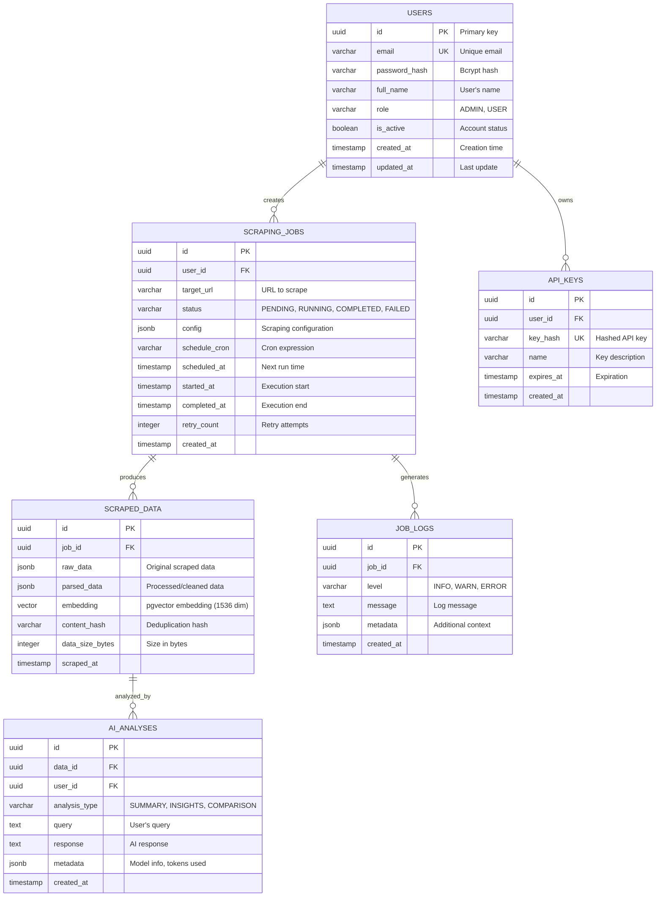

# Database Schema

## Entity Relationship Diagram



## SQL Schema

### Users Table
```sql
CREATE TABLE users (
    id UUID PRIMARY KEY DEFAULT gen_random_uuid(),
    email VARCHAR(255) UNIQUE NOT NULL,
    password_hash VARCHAR(255) NOT NULL,
    full_name VARCHAR(255),
    role VARCHAR(50) DEFAULT 'USER',
    is_active BOOLEAN DEFAULT true,
    created_at TIMESTAMP DEFAULT CURRENT_TIMESTAMP,
    updated_at TIMESTAMP DEFAULT CURRENT_TIMESTAMP
);

CREATE INDEX idx_users_email ON users(email);
```

### Scraping Jobs Table
```sql
CREATE TABLE scraping_jobs (
    id UUID PRIMARY KEY DEFAULT gen_random_uuid(),
    user_id UUID REFERENCES users(id) ON DELETE CASCADE,
    target_url TEXT NOT NULL,
    status VARCHAR(50) DEFAULT 'PENDING',
    config JSONB DEFAULT '{}',
    schedule_cron VARCHAR(100),
    scheduled_at TIMESTAMP,
    started_at TIMESTAMP,
    completed_at TIMESTAMP,
    retry_count INTEGER DEFAULT 0,
    created_at TIMESTAMP DEFAULT CURRENT_TIMESTAMP,
    
    CONSTRAINT valid_status CHECK (status IN ('PENDING', 'RUNNING', 'COMPLETED', 'FAILED', 'CANCELLED'))
);

CREATE INDEX idx_jobs_user ON scraping_jobs(user_id);
CREATE INDEX idx_jobs_status ON scraping_jobs(status);
CREATE INDEX idx_jobs_scheduled ON scraping_jobs(scheduled_at);
```

### Scraped Data Table (with pgvector)
```sql
-- Enable pgvector extension
CREATE EXTENSION IF NOT EXISTS vector;

CREATE TABLE scraped_data (
    id UUID PRIMARY KEY DEFAULT gen_random_uuid(),
    job_id UUID REFERENCES scraping_jobs(id) ON DELETE CASCADE,
    raw_data JSONB NOT NULL,
    parsed_data JSONB,
    embedding vector(1536),  -- OpenAI embedding dimension
    content_hash VARCHAR(64),
    data_size_bytes INTEGER,
    scraped_at TIMESTAMP DEFAULT CURRENT_TIMESTAMP
);

CREATE INDEX idx_data_job ON scraped_data(job_id);
CREATE INDEX idx_data_hash ON scraped_data(content_hash);

-- Vector similarity search index (IVFFlat for large datasets)
CREATE INDEX idx_data_embedding ON scraped_data 
    USING ivfflat (embedding vector_cosine_ops) WITH (lists = 100);
```

### AI Analyses Table
```sql
CREATE TABLE ai_analyses (
    id UUID PRIMARY KEY DEFAULT gen_random_uuid(),
    data_id UUID REFERENCES scraped_data(id) ON DELETE SET NULL,
    user_id UUID REFERENCES users(id) ON DELETE CASCADE,
    analysis_type VARCHAR(50) NOT NULL,
    query TEXT NOT NULL,
    response TEXT NOT NULL,
    metadata JSONB DEFAULT '{}',
    created_at TIMESTAMP DEFAULT CURRENT_TIMESTAMP
);

CREATE INDEX idx_analyses_user ON ai_analyses(user_id);
CREATE INDEX idx_analyses_type ON ai_analyses(analysis_type);
```

## Sample Queries

### Find Similar Data (Vector Search)
```sql
SELECT id, parsed_data, 
       1 - (embedding <=> $1) AS similarity
FROM scraped_data
WHERE job_id = $2
ORDER BY embedding <=> $1
LIMIT 10;
```

### Get Job Statistics
```sql
SELECT 
    status,
    COUNT(*) as count,
    AVG(EXTRACT(EPOCH FROM (completed_at - started_at))) as avg_duration_seconds
FROM scraping_jobs
WHERE user_id = $1
GROUP BY status;
```

### Recent Scraping Activity
```sql
SELECT 
    sj.id,
    sj.target_url,
    sj.status,
    COUNT(sd.id) as data_count,
    SUM(sd.data_size_bytes) as total_bytes
FROM scraping_jobs sj
LEFT JOIN scraped_data sd ON sj.id = sd.job_id
WHERE sj.user_id = $1
GROUP BY sj.id
ORDER BY sj.created_at DESC
LIMIT 20;
```
