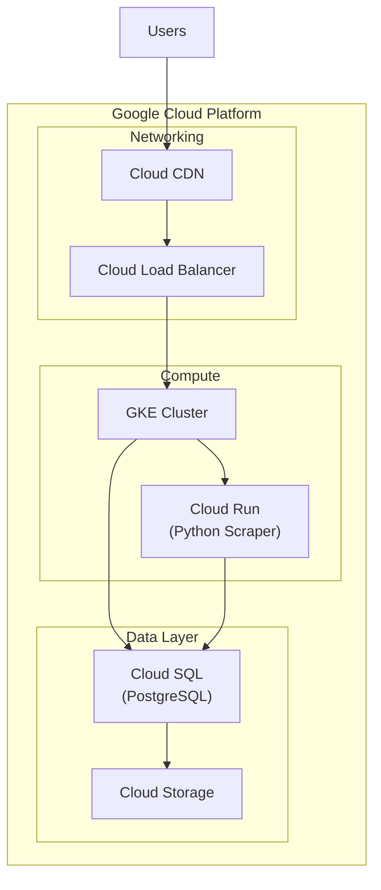

# Google Cloud Deployment Guide

## Architecture on GCP



## Services Overview

| Component | GCP Service | Purpose |
|-----------|-------------|---------|
| Frontend | Cloud CDN + Cloud Storage | Static hosting |
| Backend | GKE / Cloud Run | Spring Boot API |
| Scraper | Cloud Run | Python scraping |
| Database | Cloud SQL PostgreSQL | Primary storage |
| Storage | Cloud Storage | Backups, exports |

## Setup Steps

### 1. Project Setup
```bash
# Set project
gcloud config set project YOUR_PROJECT_ID

# Enable APIs
gcloud services enable \
    container.googleapis.com \
    sqladmin.googleapis.com \
    run.googleapis.com \
    cloudbuild.googleapis.com
```

### 2. Cloud SQL PostgreSQL
```bash
# Create instance with pgvector
gcloud sql instances create webscraper-db \
    --database-version=POSTGRES_15 \
    --tier=db-custom-2-4096 \
    --region=us-central1 \
    --database-flags=cloudsql.enable_pg_cron=on

# Create database
gcloud sql databases create webscraper --instance=webscraper-db

# Enable pgvector extension (via SQL)
# CREATE EXTENSION vector;
```

### 3. GKE Cluster (Backend)
```bash
# Create cluster
gcloud container clusters create webscraper-cluster \
    --zone=us-central1-a \
    --num-nodes=3 \
    --machine-type=e2-standard-2

# Get credentials
gcloud container clusters get-credentials webscraper-cluster
```

### 4. Cloud Run (Python Scraper)
```bash
# Build and deploy
gcloud builds submit --tag gcr.io/PROJECT_ID/scraper
gcloud run deploy scraper \
    --image gcr.io/PROJECT_ID/scraper \
    --platform managed \
    --region us-central1 \
    --memory 2Gi \
    --timeout 300
```

## Kubernetes Manifests

### Backend Deployment
```yaml
# k8s/backend-deployment.yaml
apiVersion: apps/v1
kind: Deployment
metadata:
  name: webscraper-backend
spec:
  replicas: 3
  selector:
    matchLabels:
      app: backend
  template:
    metadata:
      labels:
        app: backend
    spec:
      containers:
      - name: backend
        image: gcr.io/PROJECT_ID/backend:latest
        ports:
        - containerPort: 8080
        env:
        - name: DB_HOST
          valueFrom:
            secretKeyRef:
              name: db-secrets
              key: host
        - name: SPRING_PROFILES_ACTIVE
          value: "prod"
        resources:
          requests:
            memory: "512Mi"
            cpu: "250m"
          limits:
            memory: "1Gi"
            cpu: "500m"
---
apiVersion: v1
kind: Service
metadata:
  name: backend-service
spec:
  type: LoadBalancer
  ports:
  - port: 80
    targetPort: 8080
  selector:
    app: backend
```

### Secrets Configuration
```bash
# Create secrets
kubectl create secret generic db-secrets \
    --from-literal=host=CLOUD_SQL_IP \
    --from-literal=username=postgres \
    --from-literal=password=YOUR_PASSWORD

kubectl create secret generic api-secrets \
    --from-literal=jwt-secret=YOUR_JWT_SECRET \
    --from-literal=openai-key=YOUR_OPENAI_KEY
```

## CI/CD with Cloud Build

```yaml
# cloudbuild.yaml
steps:
  # Build backend
  - name: 'gcr.io/cloud-builders/docker'
    args: ['build', '-t', 'gcr.io/$PROJECT_ID/backend', './backend']
  
  # Build scraper  
  - name: 'gcr.io/cloud-builders/docker'
    args: ['build', '-t', 'gcr.io/$PROJECT_ID/scraper', './scraper']
  
  # Push images
  - name: 'gcr.io/cloud-builders/docker'
    args: ['push', 'gcr.io/$PROJECT_ID/backend']
  - name: 'gcr.io/cloud-builders/docker'
    args: ['push', 'gcr.io/$PROJECT_ID/scraper']
  
  # Deploy to GKE
  - name: 'gcr.io/cloud-builders/kubectl'
    args: ['apply', '-f', 'k8s/']
    env:
    - 'CLOUDSDK_COMPUTE_ZONE=us-central1-a'
    - 'CLOUDSDK_CONTAINER_CLUSTER=webscraper-cluster'

images:
  - 'gcr.io/$PROJECT_ID/backend'
  - 'gcr.io/$PROJECT_ID/scraper'
```

## Cost Estimation

| Service | Estimated Monthly Cost |
|---------|----------------------|
| Cloud SQL (db-custom-2-4096) | ~$100 |
| GKE (3x e2-standard-2) | ~$150 |
| Cloud Run (moderate usage) | ~$30 |
| Cloud Storage | ~$10 |
| Network/CDN | ~$20 |
| **Total** | **~$310/month** |

## Security Checklist

- [ ] Enable VPC Service Controls
- [ ] Configure Cloud IAM roles
- [ ] Set up Cloud Armor (WAF)
- [ ] Enable Cloud Audit Logs
- [ ] Configure SSL certificates
- [ ] Set up Secret Manager for credentials
