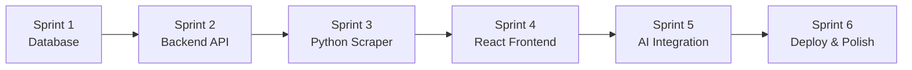
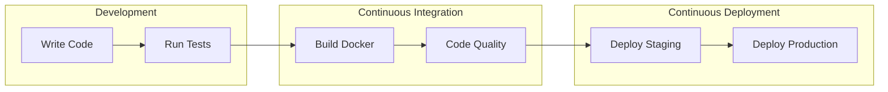

# DevOps Implementation Roadmap

## Overview
Iterative development with **test-first approach**. Each sprint delivers working, tested features.



---

## Sprint 1: Database Foundation (Days 1-2)

### Tasks
| ID | Task | Test | Status |
|----|------|------|--------|
| 1.1 | Set up PostgreSQL locally | Connection test | ⬜ |
| 1.2 | Create users table | Insert/query test | ⬜ |
| 1.3 | Create scraping_jobs table | CRUD test | ⬜ |
| 1.4 | Create scraped_data table | Insert test | ⬜ |
| 1.5 | Enable pgvector extension | Vector query test | ⬜ |

### Prompt for Sprint 1
```
TASK: Set up PostgreSQL database with schema
CONTEXT: Web scraping platform needs storage for jobs and data
TABLES: users, scraping_jobs, scraped_data (with vector column)
TEST: Verify each table with sample insert/select queries
CONSTRAINTS: Use UUID primary keys, JSONB for flexible data
```

---

## Sprint 2: Backend API (Days 3-5)

### Tasks
| ID | Task | Test | Status |
|----|------|------|--------|
| 2.1 | Initialize Spring Boot project | App starts | ⬜ |
| 2.2 | Create JPA entities | Unit tests | ⬜ |
| 2.3 | Build ScrapingController | MockMvc tests | ⬜ |
| 2.4 | Build DataController | API tests | ⬜ |
| 2.5 | Add export endpoint (Excel/CSV) | Download test | ⬜ |
| 2.6 | Add error handling | Error response test | ⬜ |

### Prompt for Sprint 2
```
TASK: Build Spring Boot REST API
CONTEXT: Backend for web scraping platform
ENDPOINTS: 
  - POST /api/scrape/jobs (create job)
  - GET /api/data (list with pagination)
  - GET /api/data/export?format=excel
PRINCIPLES: SOLID, clean code, O(n) max complexity
TEST: MockMvc for each endpoint, verify status codes
```

---

## Sprint 3: Python Scraper (Days 6-8)

### Tasks
| ID | Task | Test | Status |
|----|------|------|--------|
| 3.1 | Initialize Flask project | Health endpoint | ⬜ |
| 3.2 | Build Playwright engine | Scrape test site | ⬜ |
| 3.3 | Build Selenium fallback | Scrape test site | ⬜ |
| 3.4 | Add data parser | Parse HTML test | ⬜ |
| 3.5 | Connect to Spring Boot | Integration test | ⬜ |

### Prompt for Sprint 3
```
TASK: Build Python scraping microservice
CONTEXT: Receives URLs from Spring Boot, returns structured data
ENGINES: Playwright (primary), Selenium (fallback)
API: Flask with /api/scrape endpoint
TEST: pytest with mock websites, response validation
CONSTRAINTS: Async where possible, memory efficient
```

---

## Sprint 4: React Frontend (Days 9-12)

### Tasks
| ID | Task | Test | Status |
|----|------|------|--------|
| 4.1 | Initialize React + TypeScript | App loads | ⬜ |
| 4.2 | Set up MVVM structure | Folder structure | ⬜ |
| 4.3 | Build Dashboard view | Visual check | ⬜ |
| 4.4 | Build DataViewer with table | Sort/filter works | ⬜ |
| 4.5 | Add Export buttons | Download works | ⬜ |
| 4.6 | Add Help buttons (❓) | Tooltips show | ⬜ |
| 4.7 | Style with modern UI | Visual review | ⬜ |

### Prompt for Sprint 4
```
TASK: Build React frontend with MVVM pattern
CONTEXT: Dashboard for viewing/exporting scraped data
FEATURES:
  - Data table with sorting, filtering, pagination
  - Export to Excel/CSV buttons
  - Help (❓) button on every feature
PATTERN: Views → ViewModels (hooks) → Models (API)
STYLE: Modern dark theme, glassmorphism, smooth animations
TEST: Visual check, user flow testing
```

---

## Sprint 5: AI Integration (Days 13-15)

### Tasks
| ID | Task | Test | Status |
|----|------|------|--------|
| 5.1 | Set up LangChain4j | Connection test | ⬜ |
| 5.2 | Build embedding service | Generate vectors | ⬜ |
| 5.3 | Build RAG pipeline | Context retrieval | ⬜ |
| 5.4 | Create AI Controller | Query test | ⬜ |
| 5.5 | Build AI Assistant UI | User query works | ⬜ |

### Prompt for Sprint 5
```
TASK: Integrate LangChain AI for data analysis
CONTEXT: User asks questions about scraped data in natural language
PIPELINE:
  1. Store embeddings in pgvector
  2. Retrieve relevant context via similarity search
  3. Generate response with LLM
ENDPOINT: POST /api/ai/analyze
UI: Chat-like interface with quick question buttons
TEST: Query about sample data, verify relevant response
```

---

## Sprint 6: Deploy & Polish (Days 16-18)

### Tasks
| ID | Task | Test | Status |
|----|------|------|--------|
| 6.1 | Dockerize all services | Containers run | ⬜ |
| 6.2 | Set up docker-compose | Full stack runs | ⬜ |
| 6.3 | Deploy to Google Cloud | Accessible online | ⬜ |
| 6.4 | Add loading states | UX smooth | ⬜ |
| 6.5 | Final testing | End-to-end pass | ⬜ |

---

## DevOps Pipeline



---

## Testing Strategy Per Sprint

| Sprint | Unit Tests | Integration Tests | Manual Tests |
|--------|------------|-------------------|--------------|
| 1. Database | SQL queries | - | pgAdmin check |
| 2. Backend | JUnit + MockMvc | DB connection | Postman API |
| 3. Scraper | pytest | Spring ↔ Flask | Scrape real site |
| 4. Frontend | - | API calls | Visual + UX |
| 5. AI | - | RAG pipeline | Query accuracy |
| 6. Deploy | - | Full stack | E2E user flow |

---

## Current Status

🎯 **Next Step**: Sprint 1 - Database Foundation

Ready to start?
