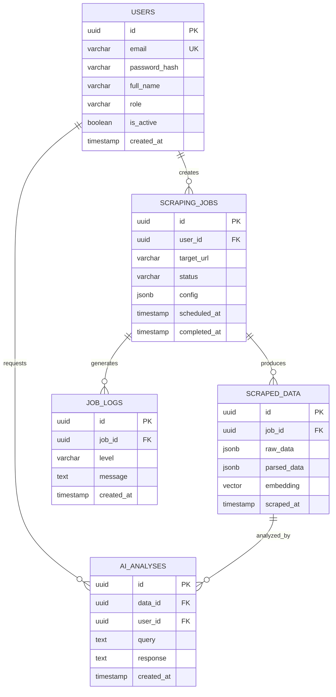
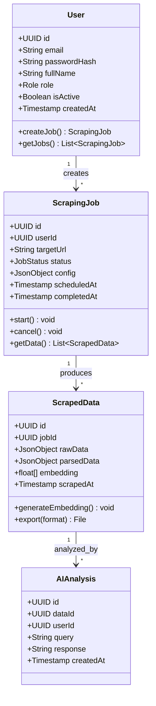
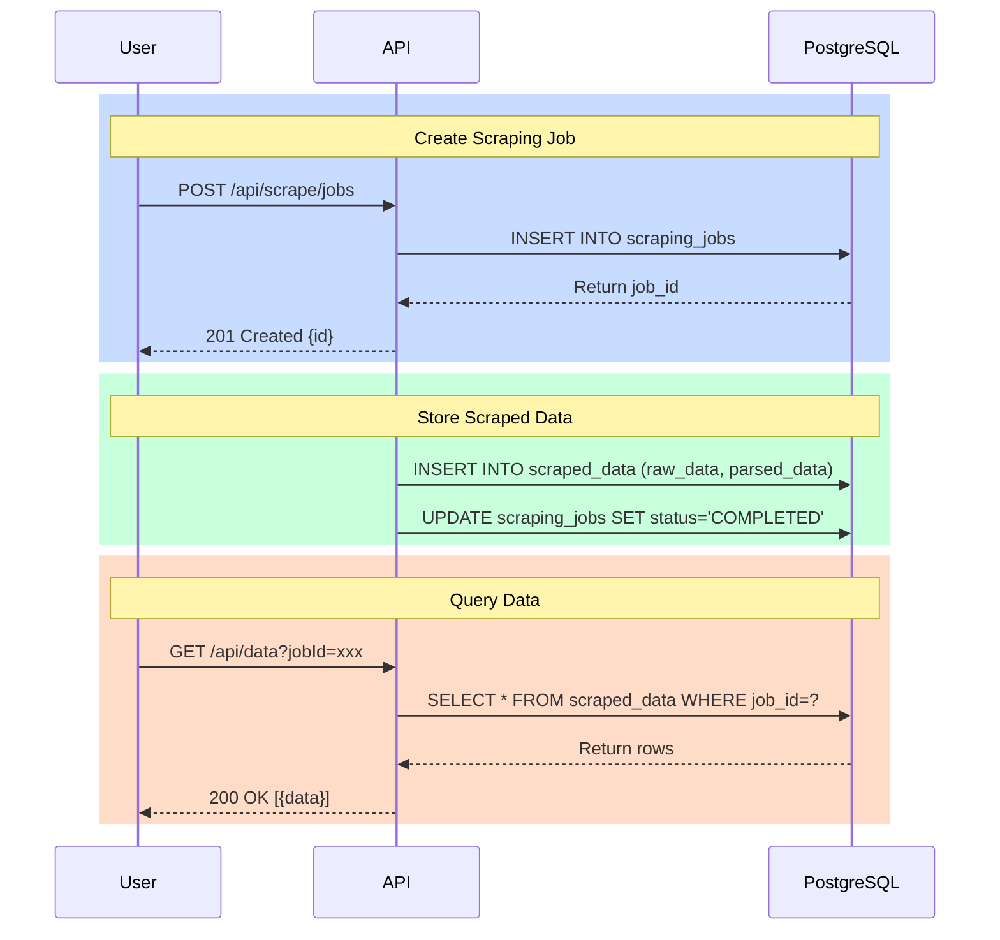

# Sprint 1: Database Design Document

## 📅 Day 1-2 | Database Foundation

---

## Functional Requirements (FR)

| ID | Requirement | Table |
|----|-------------|-------|
| FR-DB-01 | Store user accounts with authentication | users |
| FR-DB-02 | Track scraping jobs with configuration | scraping_jobs |
| FR-DB-03 | Store raw and parsed scraped data | scraped_data |
| FR-DB-04 | Log job execution events | job_logs |
| FR-DB-05 | Store AI analysis results | ai_analyses |
| FR-DB-06 | Support vector similarity search | scraped_data.embedding |

---

## Non-Functional Requirements (NFR)

| ID | Requirement | Target |
|----|-------------|--------|
| NFR-DB-01 | Query response time | < 100ms |
| NFR-DB-02 | Support concurrent connections | 50+ |
| NFR-DB-03 | Data retention | 90 days |
| NFR-DB-04 | Backup frequency | Daily |
| NFR-DB-05 | Vector search performance | < 500ms for 100k rows |

---

## Entity Relationship Diagram (ERD)



---

## UML Class Diagram



---

## Sequence Diagram: Data Flow



---

## Implementation Task List

| Order | Task | File | Test |
|-------|------|------|------|
| 1 | Create database folder structure | `database/` | - |
| 2 | Write migration V1: users table | `V1__create_users.sql` | INSERT test |
| 3 | Write migration V2: scraping_jobs | `V2__create_jobs.sql` | INSERT test |
| 4 | Write migration V3: scraped_data | `V3__create_data.sql` | INSERT test |
| 5 | Write migration V4: pgvector | `V4__enable_pgvector.sql` | Vector query |
| 6 | Write migration V5: indexes | `V5__create_indexes.sql` | Query speed |
| 7 | Create test data script | `seed_test_data.sql` | Visual check |
| 8 | Create docker-compose for PostgreSQL | `docker-compose.yml` | `docker-compose up` |

---

## File Structure

```
database/
├── migrations/
│   ├── V1__create_users.sql
│   ├── V2__create_scraping_jobs.sql
│   ├── V3__create_scraped_data.sql
│   ├── V4__enable_pgvector.sql
│   ├── V5__create_indexes.sql
│   └── V6__create_views.sql
├── seeds/
│   └── test_data.sql
├── docker-compose.yml
└── README.md
```

---

## Ready to Implement?

Once you approve this design, I will:
1. Create the `database/` folder structure
2. Write each SQL migration file
3. Set up Docker for PostgreSQL
4. Test each table with sample data
