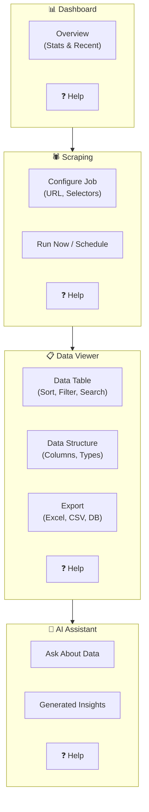

# User Requirements Document

## User Story
> "I want to view scraped data, ask AI about the data, see how it's organized, and export it to Excel or databases. The dashboard should be nice with help buttons for every feature to make everything understandable."

---

## Core Requirements

### 1. Data Viewing & Analysis
| Requirement | Priority | Description |
|-------------|----------|-------------|
| View scraped data | High | Table view with sorting/filtering |
| AI data assistant | High | Ask questions about data (natural language) |
| Data organization | High | Show data structure (columns, types) |
| Export to Excel | High | One-click Excel download |
| Export to database | Medium | Connect to external DB |

### 2. Dashboard Design
| Requirement | Priority | Description |
|-------------|----------|-------------|
| Modern, attractive UI | High | Not simple/basic looking |
| Help buttons | High | Every feature has tooltip/help |
| Understandable labels | High | Clear naming, no jargon |
| Immediate & scheduled | Medium | Toggle for job timing |

### 3. Scraping Scope
| Requirement | Priority | Description |
|-------------|----------|-------------|
| General purpose | High | Any website type |
| Flexible selectors | High | User defines what to capture |
| Multiple formats | Medium | HTML, JSON, tables, text |

---

## UI Flow Diagram



---

## Help Button System

Every section includes a **❓ Help** button that shows:

```
┌─────────────────────────────────────────────┐
│ ❓ How to use this feature                  │
├─────────────────────────────────────────────┤
│ 📝 What it does:                            │
│    Brief explanation in simple words        │
│                                             │
│ 👆 How to use:                              │
│    Step-by-step guide                       │
│                                             │
│ 💡 Tips:                                    │
│    Best practices                           │
│                                             │
│ 📹 [Watch Tutorial Video]                   │
└─────────────────────────────────────────────┘
```

---

## Export Options

| Format | Use Case |
|--------|----------|
| **Excel (.xlsx)** | Spreadsheet analysis, sharing |
| **CSV** | Simple data, any program |
| **JSON** | Developer use, APIs |
| **PostgreSQL** | Direct to your database |

---

## Data Table Features

```
┌──────────────────────────────────────────────────────────────────┐
│ 🔍 Search...                          [Filter ▼] [Export ▼] ❓   │
├──────────────────────────────────────────────────────────────────┤
│ □ │ Title ↕        │ Price ↕    │ URL           │ Date ↕       │
├───┼─────────────────┼────────────┼───────────────┼──────────────┤
│ □ │ Product A       │ $29.99     │ example.com/a │ 2024-01-15   │
│ □ │ Product B       │ $49.99     │ example.com/b │ 2024-01-15   │
│ □ │ Product C       │ $19.99     │ example.com/c │ 2024-01-14   │
├───┴─────────────────┴────────────┴───────────────┴──────────────┤
│ Showing 1-3 of 150 results          [◀ Previous] [Next ▶]       │
└──────────────────────────────────────────────────────────────────┘
```

---

## AI Assistant Panel

```
┌──────────────────────────────────────────────────────────────────┐
│ 🤖 AI Data Assistant                                         ❓  │
├──────────────────────────────────────────────────────────────────┤
│ Ask me anything about your data:                                 │
│ ┌────────────────────────────────────────────────────────────┐   │
│ │ "What is the average price of products?"                   │   │
│ └────────────────────────────────────────────────────────────┘   │
│                                                     [Ask AI →]   │
├──────────────────────────────────────────────────────────────────┤
│ 💬 Response:                                                     │
│                                                                  │
│ Based on your scraped data (150 products):                       │
│ • Average price: $33.32                                          │
│ • Lowest: $9.99 (Product X)                                      │
│ • Highest: $199.99 (Product Y)                                   │
│                                                                  │
│ Quick questions:                                                 │
│ [Summarize data] [Find trends] [Compare prices]                  │
└──────────────────────────────────────────────────────────────────┘
```
